# Progressive Terraform Security Diagrams

## Overall Architecture

## Security Evolution Journey

```mermaid
%%{init: {'theme':'dark'}}%%
graph TD
    A[Stage 1: Basic EC2] --> B[Stage 2: Parameter Store]
    B --> C[Stage 3: Secrets Manager]
    
    A1["❌ Hardcoded AMI IDs
❌ Open Security Groups
❌ No Config Management"]
    B1["✅ Dynamic AMI Selection
✅ Externalized Config
✅ Restricted Access"]
    C1["✅ Encrypted Secrets
✅ Automatic Rotation
✅ Audit Trail"]
    
    A --> A1
    B --> B1
    C --> C1
    
    style A fill:#8b0000,stroke:#fff,stroke-width:2px,color:#fff
    style B fill:#b8860b,stroke:#fff,stroke-width:2px,color:#fff
    style C fill:#006400,stroke:#fff,stroke-width:2px,color:#fff
    style A1 fill:#4a0000,stroke:#fff,stroke-width:1px,color:#fff
    style B1 fill:#5c4317,stroke:#fff,stroke-width:1px,color:#fff
    style C1 fill:#003200,stroke:#fff,stroke-width:1px,color:#fff
```

## Stage 1: Basic EC2 (Security Issues)

```mermaid
%%{init: {'theme':'dark'}}%%
graph TB
    subgraph "Stage 1: Hardcoded Values"
        A[Terraform Code] --> B[EC2 Instance]
        A --> C[Security Group]
        
        D["ami-0c02fb55956c7d316
❌ Hardcoded AMI"]
        E["0.0.0.0/0
❌ Open to Internet"]
        
        A -.-> D
        C -.-> E
    end
    
    style A fill:#8b0000,stroke:#fff,stroke-width:2px,color:#fff
    style B fill:#8b0000,stroke:#fff,stroke-width:2px,color:#fff
    style C fill:#8b0000,stroke:#fff,stroke-width:2px,color:#fff
    style D fill:#ff4444,stroke:#fff,stroke-width:2px,color:#fff
    style E fill:#ff4444,stroke:#fff,stroke-width:2px,color:#fff
```

## Stage 2: Parameter Store Integration

## Stage 3: Secrets Manager Integration

```mermaid
%%{init: {'theme':'dark'}}%%
graph TB
    subgraph "Stage 3: Enterprise Security"
        A[Terraform Code] --> B[Parameter Store]
        A --> C[Secrets Manager]
        B --> D[EC2 Instance]
        C --> D
        A --> E[Security Group]
        
        F["Configuration Values
✅ AMI, Instance Type, CIDR"]
        G["API Credentials
🔐 Encrypted Secrets"]
        
        B -.-> F
        C -.-> G
    end
    
    style A fill:#006400,stroke:#fff,stroke-width:2px,color:#fff
    style B fill:#1e90ff,stroke:#fff,stroke-width:2px,color:#fff
    style C fill:#9932cc,stroke:#fff,stroke-width:2px,color:#fff
    style D fill:#006400,stroke:#fff,stroke-width:2px,color:#fff
    style E fill:#006400,stroke:#fff,stroke-width:2px,color:#fff
    style F fill:#32cd32,stroke:#fff,stroke-width:2px,color:#000
    style G fill:#ff69b4,stroke:#fff,stroke-width:2px,color:#fff
```

## CI/CD Pipeline Flow

