# Progressive Terraform Security Diagrams

## Overall Architecture


## Security Evolution Journey

```mermaid
graph TD
    A[Stage 1: Basic EC2] --> B[Stage 2: Parameter Store]
    B --> C[Stage 3: Secrets Manager]
    
    A1[❌ Hardcoded AMI IDs<br/>❌ Open Security Groups<br/>❌ No Config Management]
    B1[✅ Dynamic AMI Selection<br/>✅ Externalized Config<br/>✅ Restricted Access]
    C1[✅ Encrypted Secrets<br/>✅ Automatic Rotation<br/>✅ Audit Trail]
    
    A --> A1
    B --> B1
    C --> C1
    
    style A fill:#ffcccc
    style B fill:#ffffcc
    style C fill:#ccffcc
    style A1 fill:#ffeeee
    style B1 fill:#ffffee
    style C1 fill:#eeffee
```



## Stage 1: Basic EC2 (Security Issues)

```mermaid
graph TB
    subgraph "Stage 1: Hardcoded Values"
        A[Terraform Code] --> B[EC2 Instance]
        A --> C[Security Group]
        
        D[ami-0c02fb55956c7d316<br/>❌ Hardcoded AMI]
        E[0.0.0.0/0<br/>❌ Open to Internet]
        
        A -.-> D
        C -.-> E
    end
    
    style A fill:#ffcccc
    style B fill:#ffcccc
    style C fill:#ffcccc
    style D fill:#ff9999
    style E fill:#ff9999
```



## Stage 2: Parameter Store Integration

```mermaid
graph TB
    subgraph "Stage 2: Configuration Management"
        A[Terraform Code] --> B[Parameter Store]
        B --> C[EC2 Instance]
        A --> D[Security Group]
        
        E[/aws/service/ami-amazon-linux-latest<br/>✅ Dynamic AMI]
        F[/demo/security/allowed-cidr<br/>✅ Your IP Only]
        
        B -.-> E
        D -.-> F
    end
    
    style A fill:#ffffcc
    style B fill:#cceeff
    style C fill:#ffffcc
    style D fill:#ffffcc
    style E fill:#99ff99
    style F fill:#99ff99
```

## Stage 3: Secrets Manager Integration

```mermaid
graph TB
    subgraph "Stage 3: Enterprise Security"
        A[Terraform Code] --> B[Parameter Store]
        A --> C[Secrets Manager]
        B --> D[EC2 Instance]
        C --> D
        A --> E[Security Group]
        
        F[Configuration Values<br/>✅ AMI, Instance Type, CIDR]
        G[API Credentials<br/>🔐 Encrypted Secrets]
        
        B -.-> F
        C -.-> G
    end
    
    style A fill:#ccffcc
    style B fill:#cceeff
    style C fill:#ffccff
    style D fill:#ccffcc
    style E fill:#ccffcc
    style F fill:#99ff99
    style G fill:#ff99ff
```



## CI/CD Pipeline Flow


## Security Comparison Matrix

```mermaid
graph TD
    subgraph "Security Features Comparison"
        A[Stage 1<br/>Basic] --> A1[❌ Hardcoded Values<br/>❌ Open Security<br/>❌ No Secrets Mgmt<br/>❌ Region Locked]
        B[Stage 2<br/>Parameter Store] --> B1[✅ Dynamic Config<br/>✅ Restricted Access<br/>❌ No Secrets Mgmt<br/>✅ Region Agnostic]
        C[Stage 3<br/>Secrets Manager] --> C1[✅ Dynamic Config<br/>✅ Restricted Access<br/>✅ Encrypted Secrets<br/>✅ Audit Trail]
    end
    
    style A fill:#ffcccc
    style A1 fill:#ffeeee
    style B fill:#ffffcc
    style B1 fill:#ffffee
    style C fill:#ccffcc
    style C1 fill:#eeffee
```



## Cost vs Security Trade-off

